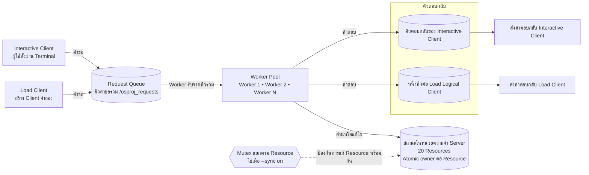
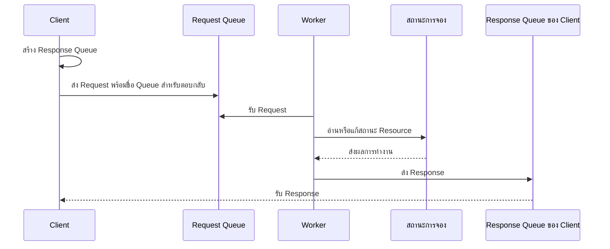

# สถาปัตยกรรม Cinema Seat Reservation System

เอกสารนี้อธิบายโครงสร้างและการทำงานภายในของระบบจองที่นั่งโรงภาพยนตร์
รายละเอียดการ Build และการทดลองอยู่ใน [README.md](../README.md)

## 1. ภาพรวมสั้น ๆ

ระบบนี้เขียนด้วย C++11 และจำลองการจอง Resource 20 รายการบน Linux ใน Docker:

1. Client ส่งคำขอผ่าน POSIX Message Queue ไปยัง Server
2. Worker Threads ใน Server รับคำขอและจัดการ Resource ร่วมกัน
3. เมื่อเปิด `--sync on` Mutex จะป้องกัน Worker หลายตัวแก้ Resource เดียวกันพร้อมกัน

สถานะการจองอยู่ในหน่วยความจำของ Server เท่านั้น ไม่มีฐานข้อมูลถาวร
เมื่อ Server หยุดทำงาน สถานะการจองจะถูกล้าง

คำศัพท์หลักในเอกสารนี้:

| คำ | ความหมาย |
|---|---|
| Resource | รายการที่ให้จอง ใช้แทนที่นั่งในตัวอย่างนี้ มีหมายเลข 1–20 |
| Client | โปรแกรมที่ส่งคำสั่งไปยัง Server |
| Worker | ตัวทำงานใน Server ที่รับคำขอแล้วประมวลผล |
| Logical Client | Client จำลองใน Load Client; แต่ละตัวทำงานเป็น Thread ในโปรแกรมเดียวกัน |
| Owner | Client ID ของผู้ที่จอง Resource อยู่; `-1` หมายถึงยังว่าง |
| Mutex | ตัวล็อกแยกแต่ละ Resource; เมื่อเปิด `--sync on` จะกัน Worker อื่นจัดการ Resource เดียวกันพร้อมกัน |

## 2. ภาพรวมสถาปัตยกรรม



Client ทั้งสองประเภทส่ง Request เข้า Queue เดียวกัน Worker ทุกตัวรอรับจาก Queue นี้โดยตรง
จึงไม่มี Dispatcher แยกต่างหาก

Load Client สร้าง Logical Client หลายตัวเป็น Threads ใน Process เดียวกัน
แต่ละ Logical Client มี Response Queue ของตัวเอง
Client สื่อสารกับ Server ผ่าน Message Queue และไม่เข้าถึงสถานะการจองโดยตรง

## 3. องค์ประกอบหลัก

### Server (ตัวจัดการระบบจอง)

ไฟล์ `codes/server.cpp` ทำหน้าที่:

- สร้างและดูแล `/osproj_requests`
- สร้าง Worker Threads ตามค่า `--workers`
- ตรวจสอบและประมวลผลคำสั่งจาก Client
- จัดการ Resource ทั้ง 20 รายการ
- พิมพ์ Server Log และส่ง Response กลับ Client

ตัวเลือกสำคัญ:

| ตัวเลือก | หน้าที่ |
|---|---|
| `--workers N` | จำนวน Worker Threads |
| `--sync on\|off` | เปิดหรือปิด Resource Mutex |
| `--delay on\|off` | สุ่มหน่วง 50–500 ms เฉพาะ `RESERVE` เมื่อ Resource ยังว่าง |
| `--verbose on\|off` | เปิดหรือปิดรายละเอียด Server Log |

### Interactive Client (Client ใช้งานผ่าน Terminal)

ไฟล์ `codes/client.cpp` เป็น Client สำหรับการใช้งานผ่าน Terminal
ผู้ใช้สามารถส่ง `LIST`, `STATUS`, `RESERVE`, `CANCEL` และ `QUIT`
หรือใช้โหมด `--once` เพื่อส่งคำสั่งเดียวแล้วจบการทำงาน

### Load Client (Client จำลองสำหรับ Load Test)

ไฟล์ `codes/client_load.cpp` สร้าง Logical Clients เป็น Threads ภายใน Process เดียวกัน
แต่ละ Logical Client เปิด Response Queue ของตัวเองและส่ง Request หลายรายการ
ใช้สำหรับ Sequential Baseline, Race Condition และ Load Test

### ไฟล์ Header ที่ใช้ร่วมกัน

- `codes/common.hpp` — ค่าคงที่, Command, Request/Response Message และ Resource Model
- `codes/message_queue.hpp` — Wrapper สำหรับเปิด, สร้าง, ส่ง, รับ และ cleanup POSIX Message Queue

## 4. เส้นทางคำขอและคำตอบ



ลำดับการทำงานมีดังนี้:

1. Server สร้าง Request Queue ชื่อ `/osproj_requests`
2. Client สร้าง Response Queue ของตัวเอง
3. Client ส่ง Request พร้อมชื่อ Response Queue ไปยัง Server
4. Worker Threads รอรับ Request จาก Queue เดียวกัน และ Worker ที่ได้รับ Request จะประมวลผล
5. Worker ส่ง Response กลับไปยัง Queue ของ Client ตัวนั้น
6. Client รอ Response ก่อนส่งคำสั่งถัดไป; Load Client ทำแบบนี้แยกกันในแต่ละ Logical Client

Client ใช้ Deadline เดียว 5 วินาทีครอบคลุมทั้งการส่ง Request เข้า Queue และการรอ Response
หากหมดเวลาก่อนรับ Response จะนับเป็น Timeout ซึ่งไม่ได้ยืนยันว่า Server ไม่ได้ประมวลผล Request

## 5. การออกแบบ Message Queue

### Queue ที่ใช้

| Queue | ผู้สร้าง | หน้าที่ |
|---|---|---|
| `/osproj_requests` | Server | รับ Request จาก Client ทุกตัว |
| `/osproj_client_<pid>_<client_id>` | Interactive Client | ส่ง Response กลับ Client แบบ Interactive |
| `/osproj_load_<pid>_<client_id>` | Load Client | ส่ง Response กลับ Logical Client |

Response Queue แยกตาม Process และ Client ID เพื่อให้ Worker ส่งคำตอบกลับถูก Client
ทุก Request ใช้ priority 0 และ Request Queue รองรับได้สูงสุด 10 ข้อความตามค่าที่กำหนดในโค้ด

### ข้อมูลคำขอ (Request)

ประกาศใน `codes/common.hpp` และส่งเป็นโครงสร้าง binary ระหว่าง Client กับ Server

| Field | ความหมาย |
|---|---|
| `command` | `LIST=1`, `STATUS=2`, `RESERVE=3`, `CANCEL=4`, `QUIT=5` |
| `client_id` | ID ของ Client ต้องเป็นจำนวนเต็มบวก |
| `resource_id` | Resource หมายเลข 1–20; `LIST` และ `QUIT` ใช้ `-1` |
| `reply_queue` | ชื่อ Queue สำหรับส่ง Response กลับ |

### ข้อมูลตอบกลับ (Response)

| Field | ความหมาย |
|---|---|
| `command` | คำสั่งที่ Response อ้างถึง |
| `client_id` | Client ที่ส่ง Request |
| `success` | `1` เมื่อสำเร็จ, `0` เมื่อถูกปฏิเสธ |
| `resource_id` | Resource ที่เกี่ยวข้อง |
| `owner_id` | เจ้าของ Resource หรือ `-1` เมื่อไม่มีเจ้าของ |
| `text` | ข้อความผลลัพธ์สำหรับแสดงให้ผู้ใช้เห็น |

## 6. สถานะการจองและ Critical Section

Critical Section คือช่วงที่ Worker อ่านหรือแก้สถานะการจองที่ใช้ร่วมกัน
เมื่อเปิด `--sync on` Mutex จะกัน Worker อื่นเข้าจัดการ Resource เดียวกันในช่วงนั้น

Resource State ทั้ง 20 รายการอยู่ใน Server Process แต่ละรายการประกอบด้วย Atomic Owner
และ `std::mutex` ของตัวเอง:

```text
Resource ID: 1..20
Owner ID:    -1 เมื่อว่าง หรือ Client ID เมื่อถูกจอง (เก็บเป็น Atomic Integer)
Mutex:      หนึ่งตัวต่อ Resource ใช้เมื่อ `--sync on`
```

การจอง Resource มีขั้นตอนสำคัญดังนี้:

```text
ตรวจสอบว่า Resource ว่าง
        ↓
Random Delay 50–500 ms (เฉพาะ RESERVE ที่ Resource ยังว่าง เมื่อเปิด --delay on)
        ↓
เปลี่ยน Owner เป็น Client ID
```

เมื่อใช้ `--sync on` คำสั่ง `STATUS`, `RESERVE` และ `CANCEL` จะ Lock Mutex
ของ Resource เป้าหมายระหว่างอ่านหรือแก้สถานะ
`RESERVE` จึงตรวจสอบและเปลี่ยน Owner ภายใต้ Lock เดียวกัน
มี Client จอง Resource นั้นสำเร็จได้เพียงรายเดียว

เมื่อใช้ `--sync off` คำสั่งเหล่านี้ไม่ Lock Mutex แต่ยังอ่านและเขียน Atomic Owner
จึงไม่มี Data Race ระดับหน่วยความจำ เพราะการอ่านและเขียน Owner เป็น Atomic
อย่างไรก็ตาม การตรวจสอบ Owner และการเขียน Owner
เป็นคนละขั้นตอน ตัวอย่างเช่น Worker สองตัวอาจอ่านว่า Resource ว่างพร้อมกัน
แล้วต่างคนต่างตอบว่าจองสำเร็จ จึงเกิด Race Condition ได้
Owner ที่เหลือใน Server จะเป็น Client ID ของ Worker ที่เขียนค่าล่าสุด

เมื่อเปิด `--delay on` การหน่วงเวลาเกิดหลังตรวจพบว่า Resource ว่างและก่อนบันทึกผู้จอง
ถ้าเปิด Sync ด้วย Worker อื่นจะรอ Mutex ระหว่างช่วงหน่วงเวลานี้

สำหรับ `LIST` เมื่อใช้ `--sync on` Server จะ Lock Mutex ทั้ง 20 ตัวตามลำดับ Resource ID
เพื่อสร้าง Snapshot ที่สอดคล้องกัน แล้วปล่อย Lock ก่อนจัดรูปแบบข้อความตอบกลับ
เมื่อใช้ `--sync off` Server อ่าน Atomic Owner ทีละ Resource โดยไม่ Lock; ค่าแต่ละตัว
อ่านได้อย่างปลอดภัย แต่ Snapshot รวมอาจสะท้อนสถานะคนละช่วงเวลา

## 7. การทดลองพร้อมกัน (Concurrency Experiments)

| การทดลอง | จำนวน Worker | Mutex (`--sync`) | Delay (`--delay`) | จุดประสงค์ |
|---|---:|---|---|---|
| Sequential Baseline | 1 | on | off | ประมวลผลทีละ Request; มีผู้จอง Resource เดียวกันสำเร็จหนึ่งราย |
| Without Synchronization | 3 | off | on | แสดง Race Condition |
| With Synchronization | 3 | on | on | แสดงว่าจองสำเร็จเพียง 1 Client |
| Load Test | 3 | on | off | หาจุดเริ่มต้นของ Timeout หรือ Failure |

### Race Condition (การจองชนกัน)

1. เปิด Server ด้วย `--workers 3 --sync off --delay on`
2. ส่ง `RESERVE` ไปยัง Resource เดียวกันจาก Client อย่างน้อย 5 ตัว
3. สังเกตจำนวน Client ที่ได้รับผลสำเร็จ

เมื่อปิด Sync, Random Delay ระหว่างการตรวจสอบกับการบันทึกผู้จอง
เปิดโอกาสให้ Worker หลายตัวอ่านสถานะว่างก่อนที่ตัวใดตัวหนึ่งจะเขียน Owner

### Synchronized Reservation (การจองเมื่อเปิด Mutex)

1. เปิด Server ด้วย `--workers 3 --sync on --delay on`
2. ส่ง `RESERVE` ไปยัง Resource เดิมจาก Client หลายตัว
3. ควรมีผู้จองสำเร็จเพียง 1 Client และที่เหลือถูกปฏิเสธ

## 8. Log และการติดตามการทำงาน

เมื่อเปิด `--verbose on` Server จะแสดง Log ใน Terminal โดยแต่ละบรรทัดประกอบด้วย:

```text
[seq=78] [t=...] [Worker-1] [Client-123] [RESERVE] [Resource-10] message
```

`seq` เป็นหมายเลขลำดับเหตุการณ์ ส่วน `t` เป็นเวลาแบบ timestamp หน่วยมิลลิวินาที

Log สำคัญสำหรับการทดลองประกอบด้วย:

- `received request`
- `check resource: AVAILABLE` หรือ `RESERVED`
- `entering critical section`
- `leaving critical section`
- ผลลัพธ์ของคำสั่ง

Log ใช้ยืนยันว่า Worker ใดประมวลผล Request และแสดงความแตกต่างระหว่าง `--sync on`
กับ `--sync off`; Critical Section Log จะแสดงเมื่อมีการถือ Mutex เท่านั้น
Log อาจพิมพ์ไม่เรียงตามค่า `seq` เพราะ Worker พิมพ์เหตุการณ์หลังประมวลผล Request
หากต้องดูตามลำดับเหตุการณ์ ให้เปรียบเทียบค่า `seq`
ตัว Server เขียน Log ไปยัง stdout/stderr ไม่ได้บันทึกลงไฟล์เอง แต่สคริปต์ทดลองสามารถ
Redirect output ไปเก็บเป็น Server Log ได้

## 9. การเริ่ม หยุด และ Cleanup

```text
เริ่ม Server
    ↓
สร้าง Request Queue /osproj_requests
    ↓
เริ่ม Worker Threads
    ↓
รับและประมวลผล Request
    ↓
SIGINT (Ctrl+C) หรือ SIGTERM
    ↓
หยุด Worker และลบ Request Queue ที่ Server สร้าง
```

`MessageQueue` จะ Unlink เฉพาะ Queue ที่ Object นั้นสร้างสำเร็จและเป็นเจ้าของ
หาก `/osproj_requests` มีอยู่ก่อน Server เริ่ม Server จะแจ้งข้อผิดพลาดและไม่ลบ Queue เดิม
Client ลบ Response Queue ของตัวเองเมื่อจบตามปกติ
ถ้า Process ถูกบังคับหยุด Queue อาจค้างอยู่และต้องตรวจสอบก่อนเริ่มใหม่

## 10. Container และสภาพแวดล้อม Build

```text
Host Machine
└── Docker Compose
    └── cpp container (Ubuntu 22.04)
        ├── g++ / Make
        ├── POSIX Message Queue
        └── /workspace  ← project directory mounted from host
```

`docker-compose.yml` ใช้ `ipc: host` ทำให้ Container ใช้ IPC namespace ของ Docker Host
(บน Docker Desktop คือ Linux VM) ร่วมกับ Process อื่นที่ใช้ namespace เดียวกัน
ชื่อ Request Queue `/osproj_requests` เป็นชื่อคงที่ และ Server สร้างด้วย `O_EXCL`
หาก Queue ชื่อนี้มีอยู่แล้ว การเริ่ม Server จะล้มเหลวแทนการเปิดใช้หรือลบ Queue เดิม
Compose ยัง Mount โฟลเดอร์โปรเจกต์ไปที่ `/workspace` เพื่อให้ Source Code และไฟล์ผลลัพธ์
ใน Container ตรงกับไฟล์บน Host

## 11. ไฟล์แต่ละส่วนทำหน้าที่อะไร

| ไฟล์ | หน้าที่ |
|---|---|
| `codes/server.cpp` | Server, Worker Threads, การจอง Resource และ Log |
| `codes/client.cpp` | Client สำหรับ Terminal และคำสั่งครั้งเดียว |
| `codes/client_load.cpp` | สร้าง Logical Clients และรวบรวม Load Metrics |
| `codes/common.hpp` | ค่าคงที่ คำสั่ง และโครงสร้าง Request/Response ที่ใช้ร่วมกัน |
| `codes/message_queue.hpp` | จัดการ POSIX Message Queue และการเชื่อมต่อของ Client |
| `codes/load_metrics.hpp` | คำนวณ Latency, Average, P95 และ Maximum |
| `codes/load_workload.hpp` | เลือก Resource เดียวหรือวน Resource แบบ Round Robin |
| `scripts/run_server.sh` | เริ่ม Server ด้วยค่าที่กำหนดใน Script |
| `scripts/demo_clients.sh` | เปิด 5 Client Processes เพื่อส่งคำสั่งต่างกันจาก Terminal เดียว |
| `scripts/project_experiments.sh` | รัน Experiments 1–3 และเก็บรายงานกับหลักฐาน |
| `scripts/experiment_helpers.sh` | ตรวจสถานะและ Cleanup เฉพาะ Server ที่ Experiment Script เปิดเอง |
| `scripts/load_test.sh` | เพิ่มจำนวน Client และบันทึกผล Load Test |
| `tests/client_load_metrics_test.cpp` | ตรวจการคำนวณ Load Metrics |
| `tests/client_load_workload_test.cpp` | ตรวจการเลือก Resource ของ Workload |
| `tests/experiment_harness_test.sh` | ตรวจการ Cleanup ของ Experiment Harness |
| `Makefile` | Build และ Clean โปรแกรม |
| `Dockerfile` | สร้าง Linux Build Environment |
| `docker-compose.yml` | สร้างและเปิด Container |
