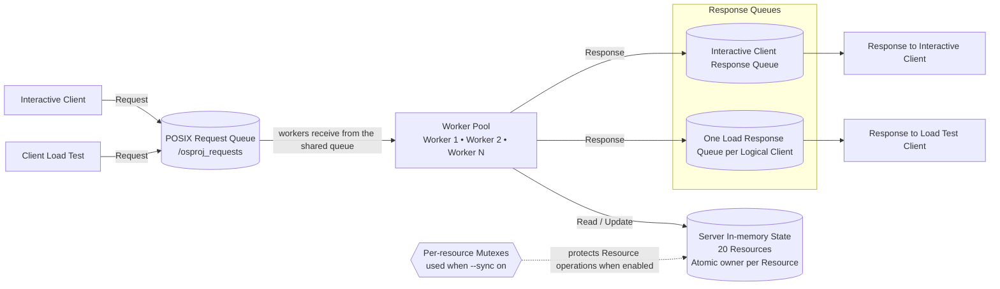
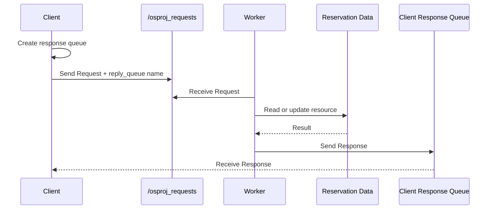

# Cinema Seat Reservation System: Architecture

เอกสารนี้อธิบายโครงสร้างและการทำงานภายในของระบบจองที่นั่งโรงภาพยนตร์
รายละเอียดการ Build และการทดลองอยู่ใน [README.md](../README.md)

## 1. ขอบเขตระบบ

ระบบนี้เป็นโปรเจกต์ Operating Systems ที่สาธิตการทำงานของ:

- C++11 บน Linux ภายใน Docker
- POSIX Named Message Queue สำหรับสื่อสารระหว่าง Process
- Worker Threads สำหรับประมวลผล Client หลายตัวพร้อมกัน
- Reservation State ในหน่วยความจำของ Server สำหรับ Resource จำนวน 20 รายการ
- Atomic Owner และ Mutex แยกต่อ Resource เพื่อประสานงานระหว่าง Worker Threads

ระบบเก็บข้อมูลการจองไว้ในหน่วยความจำของ Server เท่านั้น ไม่มีฐานข้อมูลถาวร
เมื่อ Server หยุดทำงาน ข้อมูลการจองจะถูกล้าง

## 2. ภาพรวมสถาปัตยกรรม



Client ทั้งสองประเภทส่ง Request เข้า Queue เดียวกัน Worker แต่ละตัวรอรับ Request
จาก Queue นี้โดยตรง จึงไม่มี Dispatcher แยกต่างหาก Load Client สร้าง Logical Client
เป็น Threads ภายใน Process ของตัวเอง แต่ละ Logical Client มี Response Queue ของตัวเอง

Reservation State อยู่ใน Address Space ของ Server และใช้ร่วมกันระหว่าง Worker Threads
Client Processes ไม่ได้เข้าถึง State โดยตรง แต่สื่อสารกับ Server ผ่าน Message Queue
เมื่อเปิด `--sync on` Mutex ของ Resource ที่เกี่ยวข้องจะป้องกันการทำงานกับ State นั้น

## 3. องค์ประกอบหลัก

### Server

ไฟล์ `codes/server.cpp` ทำหน้าที่:

- สร้างและดูแล `/osproj_requests`
- สร้าง Worker Threads ตามค่า `--workers`
- ตรวจสอบและประมวลผลคำสั่งจาก Client
- จัดการ Resource ทั้ง 20 รายการ
- พิมพ์ Server Log และส่ง Response กลับ Client

ตัวเลือกสำคัญ:

| Option | หน้าที่ |
|---|---|
| `--workers N` | จำนวน Worker Threads |
| `--sync on\|off` | เปิดหรือปิด Resource Mutex |
| `--delay on\|off` | เปิดหรือปิด Random Delay 50–500 ms |
| `--verbose on\|off` | เปิดหรือปิดรายละเอียด Server Log |

### Interactive Client

ไฟล์ `codes/client.cpp` เป็น Client สำหรับการใช้งานผ่าน Terminal
ผู้ใช้สามารถส่ง `LIST`, `STATUS`, `RESERVE`, `CANCEL` และ `QUIT`
หรือใช้โหมด `--once` เพื่อส่งคำสั่งเดียวแล้วจบการทำงาน

### Load Client

ไฟล์ `codes/client_load.cpp` สร้าง Logical Clients เป็น Threads ภายใน Process เดียวกัน
แต่ละ Logical Client เปิด Response Queue ของตัวเองและส่ง Request หลายรายการ
ใช้สำหรับ Sequential Baseline, Race Condition และ Load Test

### Shared Headers

- `codes/common.hpp` — ค่าคงที่, Command, Request/Response Message และ Resource Model
- `codes/message_queue.hpp` — Wrapper สำหรับเปิด, สร้าง, ส่ง, รับ และ cleanup POSIX Message Queue

## 4. Request และ Response Flow



ลำดับการทำงานมีดังนี้:

1. Server สร้าง Request Queue ชื่อ `/osproj_requests`
2. Client สร้าง Response Queue ของตัวเอง
3. Client ส่ง Request พร้อมชื่อ Response Queue ไปยัง Server
4. Worker Threads รอรับ Request จาก Queue เดียวกัน และ Worker ที่ได้รับ Request จะประมวลผล
5. Worker ส่ง Response กลับไปยัง Queue ของ Client ตัวนั้น
6. Client รอ Response ก่อนส่งคำสั่งถัดไป; Load Client ทำแบบนี้แยกกันในแต่ละ Logical Client

Client ใช้ Deadline เดียว 5 วินาทีครอบคลุมทั้งการส่ง Request เข้า Queue และการรอ Response
หากหมด Deadline ก่อนรับ Response จะนับเป็น Timeout

## 5. Message Queue Design

### Queue ที่ใช้

| Queue | ผู้สร้าง | หน้าที่ |
|---|---|---|
| `/osproj_requests` | Server | รับ Request จาก Client ทุกตัว |
| `/osproj_client_<pid>_<client_id>` | Interactive Client | ส่ง Response กลับ Client แบบ Interactive |
| `/osproj_load_<pid>_<client_id>` | Load Client | ส่ง Response กลับ Logical Client |

Response Queue แยกตาม Process และ Client ID เพื่อให้ Worker ส่งคำตอบกลับถูก Client
ทุก Request ใช้ priority 0 และ Request Queue รองรับได้สูงสุด 10 ข้อความตามค่าที่กำหนดในโค้ด

### Request Message

ประกาศใน `codes/common.hpp` และส่งเป็นโครงสร้าง binary ระหว่าง Client กับ Server

| Field | ความหมาย |
|---|---|
| `command` | `LIST=1`, `STATUS=2`, `RESERVE=3`, `CANCEL=4`, `QUIT=5` |
| `client_id` | ID ของ Client ต้องเป็นจำนวนเต็มบวก |
| `resource_id` | Resource หมายเลข 1–20; `LIST` และ `QUIT` ใช้ `-1` |
| `reply_queue` | ชื่อ Queue สำหรับส่ง Response กลับ |

### Response Message

| Field | ความหมาย |
|---|---|
| `command` | คำสั่งที่ Response อ้างถึง |
| `client_id` | Client ที่ส่ง Request |
| `success` | `1` เมื่อสำเร็จ, `0` เมื่อถูกปฏิเสธ |
| `resource_id` | Resource ที่เกี่ยวข้อง |
| `owner_id` | เจ้าของ Resource หรือ `-1` เมื่อไม่มีเจ้าของ |
| `text` | ข้อความผลลัพธ์สำหรับแสดงให้ผู้ใช้เห็น |

## 6. Reservation Data และ Critical Section

Resource State ทั้ง 20 รายการอยู่ใน Server Process แต่ละรายการประกอบด้วย Atomic Owner
และ `std::mutex` ของตัวเอง:

```text
Resource ID: 1..20
Owner ID:    -1 เมื่อว่าง หรือ Client ID เมื่อถูกจอง (เก็บเป็น Atomic Integer)
Mutex:      หนึ่งตัวต่อ Resource ใช้เมื่อ `--sync on`
```

การจอง Resource มีขั้นตอนสำคัญคือ:

```text
ตรวจสอบว่า Resource ว่าง
        ↓
Random Delay 50–500 ms (เฉพาะ RESERVE ที่ Resource ยังว่าง เมื่อเปิด --delay on)
        ↓
เปลี่ยน Owner เป็น Client ID
```

เมื่อใช้ `--sync on` คำสั่ง `STATUS`, `RESERVE` และ `CANCEL` จะ Lock Mutex
ของ Resource เป้าหมายระหว่างอ่านและดำเนินการ ส่วน `RESERVE` จึงตรวจสอบและแก้ Owner
ภายใต้ Lock เดียวกัน ทำให้มีผู้จอง Resource นั้นสำเร็จได้เพียงรายเดียว

เมื่อใช้ `--sync off` คำสั่งเหล่านี้ไม่ Lock Mutex แต่ยังอ่านและเขียน Atomic Owner
จึงไม่มี Data Race ระดับหน่วยความจำ การตรวจสอบ Owner กับการเขียน Owner ยังคงเป็นคนละขั้น
และอาจเกิด Race Condition ที่ทำให้มีการจอง Resource เดียวกันสำเร็จมากกว่าหนึ่งราย

สำหรับ `LIST` เมื่อใช้ `--sync on` Server จะ Lock Mutex ทั้ง 20 ตัวตามลำดับ Resource ID
เพื่อสร้าง Snapshot ที่สอดคล้องกัน แล้วปล่อย Lock ก่อนจัดรูปแบบข้อความตอบกลับ
เมื่อใช้ `--sync off` Server อ่าน Atomic Owner ทีละ Resource โดยไม่ Lock; ค่าแต่ละตัว
อ่านได้อย่างปลอดภัย แต่ Snapshot รวมอาจสะท้อนสถานะคนละช่วงเวลา

## 7. Concurrency Experiments

| Experiment | Workers | Sync | Delay | จุดประสงค์ |
|---|---:|---|---|---|
| Sequential Baseline | 1 | On | Off | ประมวลผลทีละ Request; มีผู้จอง Resource เดียวกันสำเร็จหนึ่งราย |
| Without Synchronization | 3 | Off | On | แสดง Race Condition |
| With Synchronization | 3 | On | On | แสดงว่าจองสำเร็จเพียง 1 Client |
| Load Test | 3 | On | Off | หาจุดเริ่มต้นของ Timeout หรือ Failure |

### Race Condition

1. เปิด Server ด้วย `--workers 3 --sync off --delay on`
2. ส่ง `RESERVE` ไปยัง Resource เดียวกันจาก Client อย่างน้อย 5 ตัว
3. สังเกตจำนวน Client ที่ได้รับผลสำเร็จ

Random Delay ที่อยู่ระหว่าง Check และ Update เพิ่มโอกาสให้ Worker หลายตัวอ่านสถานะว่างพร้อมกัน

### Synchronized Reservation

1. เปิด Server ด้วย `--workers 3 --sync on --delay on`
2. ส่ง `RESERVE` ไปยัง Resource เดิมจาก Client หลายตัว
3. ควรมีผู้จองสำเร็จเพียง 1 Client และที่เหลือถูกปฏิเสธ

## 8. Logging และ Observability

เมื่อเปิด `--verbose on` Server จะแสดง Log ใน Terminal โดยแต่ละบรรทัดประกอบด้วย:

```text
[sequence] [time] [Worker ID] [Client ID] [Command] [Resource ID] message
```

Log สำคัญสำหรับการทดลองประกอบด้วย:

- `received request`
- `check resource: AVAILABLE` หรือ `RESERVED`
- `entering critical section`
- `leaving critical section`
- ผลลัพธ์ของคำสั่ง

Log ใช้ยืนยันว่า Worker ใดประมวลผล Request และแสดงความแตกต่างระหว่าง `--sync on`
กับ `--sync off`; Critical Section Log จะแสดงเมื่อมีการถือ Mutex เท่านั้น
ตัว Server เขียน Log ไปยัง stdout/stderr ไม่ได้บันทึกลงไฟล์เอง แต่สคริปต์ทดลองสามารถ
Redirect output ไปเก็บเป็น Server Log ได้

## 9. Lifecycle และ Cleanup

```text
Start Server
    ↓
Create /osproj_requests
    ↓
Start Worker Threads
    ↓
Receive and process Requests
    ↓
SIGINT (Ctrl+C) หรือ SIGTERM
    ↓
Stop Workers and remove Request Queue
```

`MessageQueue` จะ Unlink เฉพาะ Queue ที่ Object นั้นสร้างสำเร็จและเป็นเจ้าของ
ดังนั้นหาก Server สร้าง `/osproj_requests` ไม่สำเร็จเพราะชื่อนี้มีอยู่แล้ว
Server จะรายงานข้อผิดพลาดและไม่ลบ Queue เดิม Client จะลบ Response Queue ของตัวเอง
เมื่อจบการทำงานตามปกติ ถ้า Process ถูกบังคับหยุด อาจต้องตรวจสอบ Queue ที่ค้างก่อนเริ่มใหม่

## 10. Container and Build Architecture

```text
Host Machine
└── Docker Compose
    └── cpp container (Ubuntu 22.04)
        ├── g++ / Make
        ├── POSIX Message Queue
        └── /workspace  ← project directory mounted from host
```

`docker-compose.yml` ใช้ `ipc: host` ทำให้ Container ใช้ IPC namespace ของ Docker Host
(บน Docker Desktop คือ Linux VM) ร่วมกับ Process อื่นที่ใช้ namespace เดียวกัน
ชื่อ Request Queue `/osproj_requests` เป็นชื่อคงที่ และ Server สร้างด้วย `O_EXCL`
หาก Queue ชื่อนี้มีอยู่แล้ว การเริ่ม Server จะล้มเหลวแทนการเปิดใช้หรือลบ Queue เดิม
Compose ยัง Mount โฟลเดอร์โปรเจกต์ไปที่ `/workspace` เพื่อให้ Source Code และไฟล์ผลลัพธ์
ใน Container ตรงกับไฟล์บน Host

## 11. Source-to-Responsibility Map

| File | Responsibility |
|---|---|
| `codes/server.cpp` | Server, Worker Threads, Reservation Logic และ Logging |
| `codes/client.cpp` | Interactive/Once Client |
| `codes/client_load.cpp` | Logical Clients และ Load Metrics |
| `codes/common.hpp` | Shared Constants, Commands และ Message Structures |
| `codes/message_queue.hpp` | POSIX Message Queue Wrapper และ Client Connection |
| `codes/load_metrics.hpp` | สถิติ Latency, Average, P95 และ Maximum |
| `codes/load_workload.hpp` | เลือก Resource เดียวหรือกระจายแบบ Round Robin |
| `scripts/run_server.sh` | ช่วยเริ่ม Server |
| `scripts/demo_clients.sh` | เปิด Client 5 processes ส่งคำสั่งต่างกันจาก Terminal เดียว |
| `scripts/project_experiments.sh` | รัน Experiments 1–3 และเก็บรายงานกับหลักฐาน |
| `scripts/experiment_helpers.sh` | ตรวจสถานะและ Cleanup เฉพาะ Server ที่ Harness เปิดเอง |
| `scripts/load_test.sh` | เพิ่มจำนวน Client สำหรับ Load Test |
| `tests/client_load_metrics_test.cpp` | ทดสอบการคำนวณ Load Metrics |
| `tests/client_load_workload_test.cpp` | ทดสอบการเลือก Resource ของ Workload |
| `tests/experiment_harness_test.sh` | ทดสอบกติกา Cleanup ของ Experiment Harness |
| `Makefile` | Build และ Clean Binary |
| `Dockerfile` | สร้าง Linux Build Environment |
| `docker-compose.yml` | สร้างและเปิด Container |
